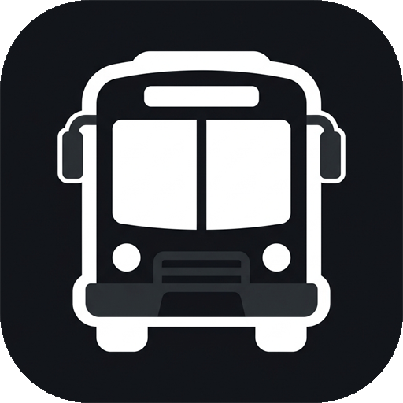
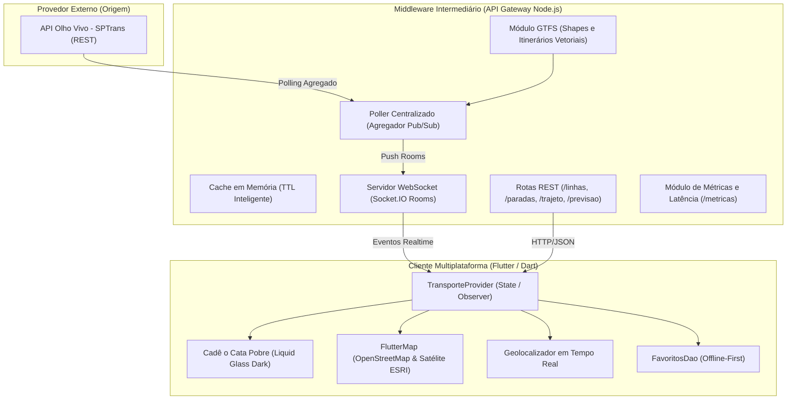

# 🚌 Cadê o Cata Pobre
### Rastreamento de Ônibus em Tempo Real (SPTrans Olho Vivo) & Sistemas Distribuídos

<p align="center">
  
</p>

<p align="center">
  <b>Aplicativo multiplataforma em Flutter com arquitetura de Sistemas Distribuídos e design Liquid Glass.</b><br>
  Monitoramento ao vivo da frota de ônibus urbanos de São Paulo conectado à API Olho Vivo da SPTrans via WebSockets e dados GTFS de alta precisão.
</p>

<p align="center">
  
  
  
  
  
</p>

---

## 📸 Demonstração do Projeto

| Mapa ao Vivo com GPS | Busca Limpa de Linhas | Itinerários & Paradas |
| :---: | :---: | :---: |
| Rastreamento de veículos, localização do usuário em tempo real e rotas GTFS | Busca dinâmica sem termos mockados e cards translúcidos de alto contraste | Previsões de chegada em paradas e acompanhamento detalhado |

---

## 🏛️ Arquitetura de Sistemas Distribuídos

O projeto foi projetado seguindo as melhores práticas de **Sistemas Distribuídos**, resolvendo problemas clássicos de concorrência e escalabilidade em aplicações móveis de transporte:



### Conceitos Fundamentais Implementados:
1. **Padrão API Gateway / Intermediador**: O app cliente móvel nunca contata a SPTrans diretamente. O Middleware centraliza as credenciais de autenticação, renova cookies expirados automaticamente com retry exponencial e mascara formatos de rede.
2. **Mitigação do Problema C10K**: Quando centenas de usuários acompanham simultaneamente a mesma linha (ex: 8000-10), o Poller do servidor executa apenas **uma** consulta periódica à SPTrans e distribui o payload a todos os clientes via canais WebSockets (Publish/Subscribe).
3. **Observabilidade e RTT**: Monitoramento da latência de rede em tempo real por meio de pings periódicos, exibindo a qualidade da conexão no cabeçalho e na tela de métricas.
4. **Tolerância a Falhas**: Fallback inteligente com motor de simulação dinâmica caso a API externa da SPTrans esteja offline ou indisponível.
5. **Localização em Tempo Real**: Rastreamento da localização do usuário com marcador dinâmico estilo Apple Maps e centralização suave de câmera.

---

## ✨ Recursos do Aplicativo

- 🧭 **Localização do Usuário em Tempo Real**: Marcador de alta visibilidade com anel pulsante e botão de centralização no mapa.
- 🗺️ **Mapa Interativo Multi-Camadas**: Alternador rápido entre visão de ruas (*OpenStreetMap*) e imagem aérea de satélite (*ESRI World Imagery*), sem necessidade de chaves pagas.
- 🚍 **Rastreamento de Ônibus ao Vivo**: Posição dos veículos atualizada continuamente, com indicador de acessibilidade para cadeirantes (PMR).
- 🛣️ **Traçado Vetorial Fiel (GTFS)**: Desenho do itinerário real percorrido pelos ônibus pelas vias de São Paulo.
- 🔍 **Busca Limpa & Instantânea**: Pesquisa por número ou destino de linha e por rua/avenida de paradas, sem termos fixos ou poluídos.
- ⭐ **Favoritos & Offline-First**: Salve linhas e paradas preferidas para consulta rápida mesmo sem conexão com a internet.
- 💎 **Design Liquid Glass Clean**: Visual escuro moderno baseado nas diretrizes de design Apple HIG, com superfícies translúcidas escurecidas de alto contraste e tipografia refinada (Google Fonts Inter).

---

## 🚀 Como Executar o Projeto Localmente

### Pré-requisitos
- [Node.js 18+](https://nodejs.org/)
- [Flutter SDK 3.x](https://flutter.dev/) configurado no PATH
- Navegador Google Chrome ou dispositivo Android conectado

### 1. Iniciar o Middleware (Node.js)
```bash
cd middleware

# Instalar dependências
npm install

# Copiar arquivo de variáveis de ambiente
cp .env.example .env
```

Edite o arquivo `.env` inserindo seu token gratuito da API SPTrans Olho Vivo (caso não possua, o servidor entrará em modo de simulação automaticamente):
```env
SPTRANS_TOKEN=seu_token_aqui
PORT=3000
POLL_INTERVAL_MS=15000
```

Inicie o servidor:
```bash
npm start
```
> O servidor estará rodando em `http://localhost:3000`.

---

### 2. Iniciar o Aplicativo (Flutter)
Em um novo terminal:
```bash
cd app_transporte

# Baixar pacotes
flutter pub get

# Executar no navegador Chrome
flutter run -d chrome

# Ou executar no Desktop Windows
flutter run -d windows
```

---

## 🧪 Validação e Testes

Para executar as análises estáticas de código e garantir zero falhas:
```bash
cd app_transporte
flutter analyze
flutter test
```

---

## 🌐 Como Fazer Deploy Gratuito na Nuvem

Para disponibilizar o projeto para outras pessoas acessarem na internet:

### Opção Recomendada: [Render.com](https://render.com) (100% Gratuito)
1. Crie uma conta gratuita no Render.com.
2. Crie um novo **Web Service** conectado ao seu repositório no GitHub.
3. Configure:
   - **Root Directory**: `middleware`
   - **Build Command**: `npm install`
   - **Start Command**: `node src/server.js`
   - **Environment Variables**: Adicione `SPTRANS_TOKEN` com sua chave.
4. Para o frontend, gere a build de produção:
   ```bash
   cd app_transporte
   flutter build web --release
   ```
   E publique a pasta `build/web` gratuitamente na **Vercel**, **Netlify** ou faça o Express do próprio Node.js servir os arquivos estáticos!

---

## 📦 Estrutura do Repositório

```
aps-transporte/
├── .gitignore                     # Proteção contra vazamento de credenciais e dependências
├── README.md                      # Documentação completa do projeto
├── middleware/                    # Backend API Gateway em Node.js
│   ├── .env.example               # Exemplo seguro das variáveis de ambiente
│   ├── gtfs_data/                 # Dados de itinerários e shapes GTFS da SPTrans
│   ├── src/
│   │   ├── server.js              # Servidor Express & Socket.IO
│   │   ├── poller.js              # Gerenciador de polling e Pub/Sub em tempo real
│   │   ├── gtfs_loader.js         # Leitor e indexador dos dados viários GTFS
│   │   └── auth.js                # Autenticação e tolerância a falhas (SPTrans)
│   └── package.json
└── app_transporte/                # Frontend Multiplataforma em Flutter
    ├── assets/images/             # Ícones e identidade visual da marca
    ├── lib/
    │   ├── main.dart              # Ponto de entrada do app
    │   ├── models/                # Modelos de dados tipados (Linha, Veículo, Parada, etc.)
    │   ├── providers/             # Gerenciamento de estado reativo (TransporteProvider)
    │   ├── screens/               # Telas (Mapa, Linhas, Paradas, Favoritos, Métricas)
    │   ├── services/              # Clientes de comunicação HTTP REST e WebSockets
    │   ├── theme/                 # Design System Liquid Glass e tokens visuais
    │   └── widgets/               # Componentes reutilizáveis de mapa e interface
    └── pubspec.yaml               # Dependências e assets do Flutter
```

---

## 📄 Licença
Este projeto foi desenvolvido para fins acadêmicos e educacionais (Atividades Práticas Supervisionadas - APS).
Distribuído sob a licença MIT.
